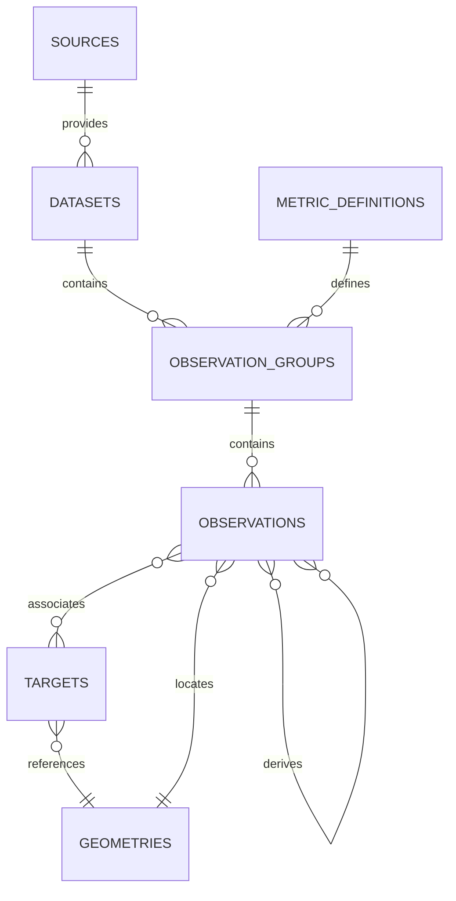

# Ridgecrest Pilot Schema

## Purpose

This first normalized schema stores provenance and scientific observations for the 2019 Ridgecrest pilot without loading any scientific dataset. The central chain is:



## Tables

- `sources` identifies publications, repositories, catalogs, or other scientific sources.
- `datasets` identifies one coherent publication-derived dataset or file reference. Binary uploads are deliberately not stored in SQLite.
- `metric_definitions` is the controlled metric glossary. Initial Ridgecrest pilot metrics are seeded from `data/processed/metric_definitions.json`.
- `targets` identifies events, faults, and fault sections. Parent targets allow a sequence or fault hierarchy without requiring scientific values.
- `observation_groups` connects a dataset to a metric and describes the coherent series representation and method.
- `observations` stores one individual value or summary, including uncertainty, quality, review, and optional geometry.
- `geometries` stores temporary SQLite-compatible coordinates or WKT/GeoJSON text.
- `observation_targets` associates one observation with multiple targets through a controlled relationship type.
- `observation_derivations` records input observations for a derived observation. Automatic derived-metric calculations are not implemented.

The distinction is intentional: a dataset is the source-level collection, an observation group is one metric series within that dataset, and an observation is one stored value or summary within the series.

## SQLite geometry representation

Point geometries use `longitude` and `latitude`. Non-point geometries may use `geometry_text` containing WKT or GeoJSON, with `geometry_format` identifying the format. The default CRS is `EPSG:4326`; original CRS and coordinate provenance are retained as metadata. This layer validates coordinate ranges but performs no conversion, spatial indexing, or GIS calculation.

When PostgreSQL/PostGIS is introduced, the geometry columns can map to PostGIS geometry types while retaining the same geometry identity, provenance, and observation relationships. No GeoAlchemy or PostGIS dependency is required for the SQLite pilot.

## Controlled vocabularies

Vocabularies are centralized in `src/earthquake_db/models/enums.py` and stored as lowercase snake_case values. They cover source type, metric category and data type, target type, value origin, review status, statistic type, component, uncertainty type, spatial representation, geometry type and format, coordinate origin, method, quality flag, and observation relationship type. `oic` is the internal spelling for the OIC method value.

## Uncertainty and source files

`uncertainty_lower` and `uncertainty_upper` are explicit bounds around `value_numeric`; the schema does not infer bounds from a standard deviation, confidence interval, or other uncertainty magnitude. Bounds must satisfy:

```text
uncertainty_lower <= value_numeric <= uncertainty_upper
```

Original files are referenced through `source_location` or `original_file_path`. They are not stored as binary values in the database.

## Initialization

Use `python -m earthquake_db.cli /tmp/ridgecrest-pilot.sqlite` to create a local SQLite database, enable foreign keys, create all tables, and load the seven metric definitions idempotently. The initializer does not drop or overwrite an existing database. The temporary path keeps generated databases outside version control.

## Known limitations

- No scientific observations have been ingested.
- No automatic coordinate or unit conversion exists.
- No derived metrics or OFD calculations exist.
- No GIS calculations or spatial indexes exist.
- Cross-database migration and PostGIS column mapping remain future work.
- Controlled vocabularies are centralized application enums and are not yet separate database lookup tables.
